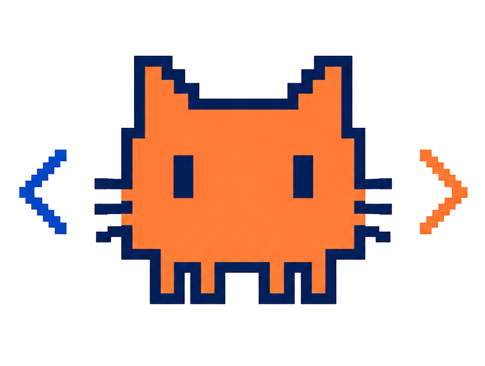
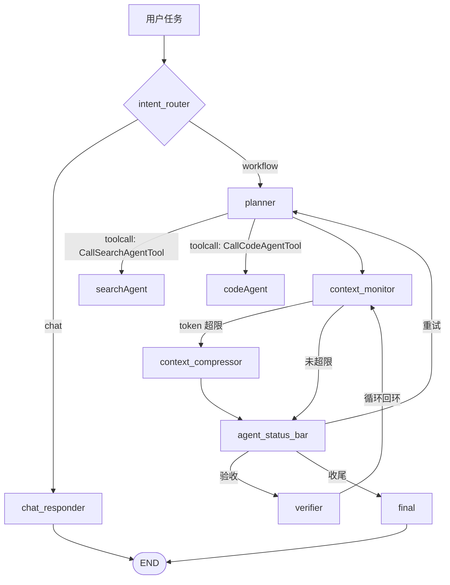

<p align="center">
  
</p>

<h1 align="center">NexusAgent</h1>

<p align="center">
  NexusAgent 是一个多智能体 CodeAgent。长任务的上下文越滚越大，一压缩就把路径、待办、产物指针全丢——我用四步重构解决这个问题，并用 12 个任务的评估集验证：成功率持平，恢复通道的质量和成本显著分化。
</p>

## 项目定位

NexusAgent 是一个基于 LangGraph 的多智能体 CodeAgent。planner 拆解任务，searchAgent 查资料，codeAgent 动手改代码，verifier 负责验收——外层工作流只管调度和重试。

这个项目的重心在 Harness：工具接口怎么设计、上下文怎么管理、权限边界怎么划、运行过程怎么观测。能力不靠感觉交付——仓库里有一套 12 个任务的评估集，每个改动都要过确定性判据和模型裁判的双重判定，前后对比的数据留在报告里。

## 项目状态

上下文工程的四步重构已经完成——超长输出落盘、关键信息白名单、滑动窗口压缩、环境状态栏；验证它们的 12 任务评估集和一轮前后 A/B 对比也做完了。交互层（Textual TUI）已可用；飞书接入、更多任务类型排在后面。

## 核心亮点

- **多智能体协作**：基于 LangGraph，planner 通过 toolcall 调度 searchAgent 和 codeAgent，外层工作流只管监督与验收循环。
- **上下文工程**：工具输出落盘（单轮 ≤2KB）+ 六板块关键信息白名单 + 滑动窗口压缩，压缩不再丢路径、待办和产物指针。
- **环境观测**：`agent_status_bar` 节点刷新 Git 分支与工作区增删改，TTL 缓存控制采集成本。
- **评估体系**：12 任务 dual-gate 评估集（确定性判据 + LLM-as-a-Judge），重构前后 A/B 实测。
- **Harness 三件套**：human-in-the-loop 命令审批、checkpoint/resume、trace 链路观测。

## 架构



## 演示任务

```bash
uv run nexusagent "写一个 Python 的 inventory 包：Inventory 类支持 add / remove / total_quantity 和大小写不敏感的 find(keyword)，配 pytest 测试并全部跑通"
```

指定 workspace：

```bash
uv run nexusagent --workspace .nexusagent/workspaces/demo "写一个 Python 的 inventory 包：Inventory 类支持 add / remove / total_quantity 和大小写不敏感的 find(keyword)，配 pytest 测试并全部跑通"
```

这个任务会走完整链路：`planner` 生成计划（创建 `inventory/` 包与 `Inventory` 类、实现大小写不敏感的 `find(keyword)`、补 pytest 测试）并经 `CallCodeAgentTool` 交给 `codeAgent`——它不需要查资料，`searchAgent` 不会被触发。`codeAgent` 用 `FileWriteTool` 写包与测试、`TodoUpdateTool` 标记进度、`BashTool` 跑 `pytest`，需要时用 `NotepadAppendTool` 记录长期笔记。`context_monitor` 估算 token，超阈值进入 `context_compressor` 滑动窗口压缩、经 `agent_status_bar` 刷新快照后回到目标节点，被逐出片段滚成增量叙事写入 `HISTORY_SUMMARY.md`。`verifier` 读取分层记忆并用 `FileReadTool` / `GrepTool` / `BashTool` 验收，失败则带建议回 `planner`，通过进入 `final`。运行期间 checkpoint 持续刷新，Trace 记录完整事件链，中断后 `--resume <workspace>` 可继续。

supervisor 把 specialist agent 当成工具调用，交接、上下文和职责边界都在终端里可见。更完整的 workspace 生命周期、checkpoint、shims、bash-outputs 讲解见 [docs/archive/workspace-lifecycle.md](docs/archive/workspace-lifecycle.md)。

## 评估与验证

重构前后 A/B 各跑一遍 12 任务：**成功率持平（12/12），token 成本 −24%（3.19M vs 4.20M），平均耗时 −43%（52.2s vs 90.9s）**。差异不在成败，在压缩后信息恢复通道的质量。以下两条证据链说明差异在哪。

重构做得好不好不由感觉决定，由 12 个任务的评估集决定（`evals/`，运行方式见 [evals/README.md](evals/README.md)）。任务分三层：3 个简单（单步修复/实现/转换）、4 个中等（搜索+写作/跨文件改名/修缺陷）、5 个长链路（加功能补测试、流水线调试、验收驱动 CLI、大语料重构、易逝碎片重组）。

**双重判定（dual-gate）**：每个任务先过确定性验证器——文件存在、内容包含、正则、命令退出码、种子未被改动、JSON 等值，全部由代码断言，不依赖模型评分；全部通过后才进入 LLM-as-a-Judge 的四维评分（事实正确性/任务完成度为 essential，过程合理性为参考，安全合规为一票否决）。危险命令（rm 越界、包安装、curl 管道执行等）按目标分区，命中即整单否决。dual-gate 的价值在 M4 任务上得到实证：确定性判据全部通过，但 Judge 从工具轨迹发现 Agent 的最终总结声称"文件没改过"与 diff 矛盾——幻觉被代码断言原理上看不见的维度抓住，整单 fail。

**L5 的证据链**：180 个单字符碎片（4 个 40 字符令牌 + 20 个干扰对照片），流程强制"读一批收走一批"，字符从磁盘消失后只能靠转录记忆或落盘产物指针恢复，哈希校验杜绝任何绕过。对比结果：**重构前后的任务成功率持平（12/12），但恢复通道的质量与成本完全分化**——新版在压缩清掉转录后，通过 Phase 1 落盘产物 + 白名单指针 + rollup 逐字保留规则，精准回读落盘产物 50 次完成重组（哈希全对）；旧版要么结构性失忆（6 次压缩、3 轮重试、四个令牌哈希全错），要么花 1.5 倍 token 违反协议暴力考古。L5 的真压力样本由 `memory_under_compression` 指标显式标注，不做模糊合计。

另有两个跨版本实证：Bash 工具名幻觉（74 次全部叫 `Bash`）通过注册表别名修复；压缩器在逐出后重建白名单并自检六板块齐全性（`whitelist_digest`），让"压缩不丢关键信息"从设计原理变成事件流里可核验的事实。

## Context Engineering

### 自动压缩

压缩走滑动窗口：按「一次节点执行」把转录分组，从最旧的组开始逐条逐出（`RemoveMessage(id=...)`，不再整表清空），只把被逐出的片段交给模型滚成一段增量叙事写进 `HISTORY_SUMMARY.md`。为避免「摘要的摘要」逐轮衰减，旧叙事条目会被折叠成单行快照，新条目始终保持完整；模型不可用时退化成确定性骨架，仍保住落盘产物的路径指针。

压缩之外还有一层不参与摘要的关键信息白名单：Goal / Constraints / TODOs / Files / Git / Artifacts 六个板块由代码在每次构建 prompt 时从实时状态重建，置于 prompt 最前，压缩不会触碰它们。其中 `[Git]` 板块由 `agent_status_bar` 节点填充，它只读地报告仓库与分支，并附一行工作区改动统计（新增/修改/删除）。默认 workspace 位于被 `.gitignore` 忽略的子目录下，git 的 dirty 统计里装的是开发者自己的未提交改动，因此不报 dirty——「改了哪些文件」交给工作区统计与 Files 白名单，两者都不依赖 git。

压缩会保留：

- 用户任务、当前计划、todo、验收标准、验证命令
- searchAgent 的研究结论和来源链接
- codeAgent 的产物、重要文件和执行摘要
- verifier 的失败原因、下一步建议和风险
- workspace 内 `TODO.md` 和 `NOTEPAD.md` 中的持久上下文

默认压缩阈值是 `400000` token，可通过环境变量调整。为了演示压缩效果，可以临时设置小阈值：

```bash
NEXUS_CONTEXT_TOKEN_LIMIT=2000 uv run nexusagent "写一个 Python 的 inventory 包：Inventory 类支持 add / remove / total_quantity 和大小写不敏感的 find(keyword)，配 pytest 测试并全部跑通"
```

### 分层记忆

分层记忆把散落在 `messages`、state、`TODO.md` 和 `NOTEPAD.md` 中的信息收束成一个 `Memory Snapshot`。节点 prompt 不再各自手写拼接大段上下文，而是统一读取三层记忆：

| Memory 层 | 来源 | 用途 |
| --- | --- | --- |
| `rules` | 系统自动生成 | 稳定规则、workspace 边界、文件职责，不暴露给 Agent 改写 |
| `working_memory` | graph state / `TODO.md` | 当前任务、计划、todo、验收标准、验证命令、来源、handoff、最近错误 |
| `history_summary_store` | `NOTEPAD.md` / `HISTORY_SUMMARY.md` / `context_summary` | 长期笔记、压缩后的历史摘要、最近压缩事件 |

运行时终端会展示 `Memory Snapshot` 面板，显示三层摘要、todo 数、source 数、handoff 数，以及 `NOTEPAD.md` 和 `HISTORY_SUMMARY.md` 是否存在。

## Harness Engineering

Harness 包含三块能力：human-in-the-loop 命令审批、checkpoint/resume、trace 链路观测。`BashTool` 被包成贴近真实 harness 的执行层，CLI 运行时持续保存可恢复的工作快照和可读的运行日志。

默认审批模式是 `inline`：

```bash
uv run nexusagent --approval-mode inline "搭建一个 FastAPI Todo 后端，并运行检查"
```

当 Agent 尝试运行 `uv add fastapi`、`pip install fastapi`、`npm install`、`curl ...`、`uvicorn ...` 等命令时，CLI 会展示命令和风险原因，并询问 `Approve? [y/N]`。输入 `y` 或 `yes` 才会执行，其余输入会拒绝该命令并把结构化失败结果返回给 Agent。

`BashTool` 每次调用都会启动 fresh shell，`export FOO=bar` 这类临时环境变量不会跨工具调用保留。执行环境会生成 `.nexusagent/shims` 并放到 `PATH` 前面，把 `python`、`python3`、`pip`、`pip3` 稳定指向当前运行 NexusAgent 的 Python；同时会优先加入 workspace 的 `.venv/bin`、`venv/bin` 和 `node_modules/.bin`，减少工具链漂移。需要跨命令复用的环境变量可以写入 workspace 下的 `.nexusagent.env`，或用 `NEXUS_BASH_ENV_FILE` 指向一个 env 文件；env 文件支持 `export KEY=value` 和 `PATH=.venv/bin:$PATH` 这类变量展开。普通命令默认最多等待 120 秒，最大允许 600 秒；长输出会截断展示，并把完整 stdout/stderr 写到 workspace 的 `.nexusagent/bash-outputs/`。长时服务应通过 `run_in_background=true` 启动，输出会落到 `.nexusagent/background/`。

可用模式：

| 模式 | 行为 |
| --- | --- |
| `inline` | 高风险命令在 CLI 中询问人类审批 |
| `deny` | 高风险命令一律拒绝，适合测试和非交互运行 |
| `auto` | 高风险命令自动批准，适合受控演示 |

Checkpoint 默认开启轻量模式：

```bash
uv run nexusagent --checkpoint-mode light "搭建一个 FastAPI Todo 后端，并运行检查"
```

如果中途按 `Ctrl+C`，NexusAgent 会在 workspace 内写入 `.nexusagent/checkpoints/RECOVERY.md` 和 `checkpoint.json`，并在 CLI 里打印恢复命令：

```bash
uv run nexusagent --resume .nexusagent/workspaces/workspace-YYYYMMDD-HHMMSS-xxxxxx
```

可用 checkpoint 模式：

| 模式 | 行为 |
| --- | --- |
| `light` | 默认模式；保存 workspace 文件快照、`TODO.md`、`NOTEPAD.md`、`HISTORY_SUMMARY.md`、恢复摘要和内部 git 文件版本，恢复时让模型基于这些上下文继续任务 |
| `strict` | 在 light 基础上保存可序列化 graph state 和事件日志；恢复时执行 state-backed restart，若 state 不可读则自动降级 light resume |
| `off` | 不保存 checkpoint |

checkpoint 文件都位于当前 workspace 的 `.nexusagent/checkpoints/`，内部 git repo 只用于该 workspace 文件快照，不会接管项目仓库。运行中会在开始、graph update、失败/审批类工具结果、中断和结束这些关键安全点刷新 checkpoint；完整事件链路由 Trace 记录。

Trace 默认开启，并在每次运行结束或中断时展示 `Trace Summary`：

```bash
uv run nexusagent --trace-mode on "搭建一个 FastAPI Todo 后端，并运行检查"
```

Trace 文件位于当前 workspace 的 `.nexusagent/traces/trace-*/`：

| 文件 | 作用 |
| --- | --- |
| `events.jsonl` | 顺序记录 run、graph update、tool call/result、handoff、checkpoint 等结构化摘要事件 |
| `summary.json` | 记录节点访问次数、工具调用数、失败工具数、审批数、checkpoint 数和最终状态 |
| `timeline.md` | 给人类阅读的简短运行时间线 |

Trace 只做观测，不改变 Agent 行为，也不替代 checkpoint/resume。

## 交互层：Textual TUI

除 Rich 时间线外，NexusAgent 提供 Textual 终端界面：

```bash
uv run nexusagent tui
```

也可以启动后立即执行一个任务：

```bash
uv run nexusagent tui "帮我创建一个简易的贪吃蛇游戏代码，并执行检查"
```

TUI 使用 `stream_session_events()` 维护一个持续 coding session：一次 TUI 会话默认绑定同一个 workspace，后续输入会带着 session history、TODO、分层 memory、checkpoint 和 trace 继续推进；一次性 Rich CLI 仍使用单轮 `stream_agent_events()`。

- 顶部展示 NexusAgent 状态和无文字像素 logo。
- 中间展示事件时间线：plan、tool call/result、handoff、verifier、final、checkpoint、trace summary。
- 右侧展示当前 session、workspace、todo、工具调用数、审批数、checkpoint 和 trace 路径。
- 底部输入消息，按 Enter 发送；一个 turn 完成后可以继续输入下一轮。
- 默认多轮复用同一个 workspace；输入 `/new` 可以切换到一个全新的 session workspace。
- 高风险 BashTool 命令会在 TUI 内弹出审批对话框，支持 `y` / Enter 批准，`n` / Esc 拒绝。

为了避免"你好"这类输入也启动完整复杂流程，LangGraph 前面增加了一个模型路由节点 `intent_router`。它会先结合当前输入和 session context 判断应该走轻量 `chat_responder`，还是进入 planner / codeAgent / verifier 复杂工作流。寒暄、感谢、帮助说明和普通概念问答会直接通过 `chat_response` 回复，只写入 session 记录，不进入 planner，也不会写 checkpoint/trace。需要创建/修改文件、运行命令、搜索资料、验证结果、检查项目，或者"继续/修一下/运行测试"这类引用当前 workspace 的后续指令时，才进入完整 MultiAgent 工作流。

TUI 子命令支持和普通 CLI 相同的运行选项：

```bash
uv run nexusagent tui --approval-mode inline --checkpoint-mode light --trace-mode on
uv run nexusagent tui --workspace .nexusagent/workspaces/my-session
uv run nexusagent tui --resume .nexusagent/workspaces/workspace-YYYYMMDD-HHMMSS-xxxxxx
```

原有一次性 CLI 仍然保留：

```bash
uv run nexusagent "写一个 Python 的 inventory 包：Inventory 类支持 add / remove / total_quantity 和大小写不敏感的 find(keyword)，配 pytest 测试并全部跑通"
```

## 文件目录

```text
NexusAgent/
├─ assets/
│  └─ logo-no-words.png
├─ docs/                        # 重构报告、面试卡片、文档索引、archive/
├─ evals/                       # 12 任务评估集（run_eval / judge / tasks）
├─ src/
│  └─ nexusagent/
│     ├─ agents/
│     │  ├─ search_agent.py     # searchAgent：Tavily 研究专家
│     │  └─ code_agent.py       # codeAgent：文件和命令执行专家
│     ├─ cli/
│     │  ├─ app.py              # Typer CLI 入口与 tui 子命令
│     │  ├─ formatter.py        # Rich 事件时间线展示
│     │  ├─ event_summary.py    # Rich CLI / Textual TUI 共用事件摘要
│     │  └─ tui/                # Textual 本地交互层
│     ├─ core/
│     │  ├─ agent.py            # LangGraph workflow 运行入口
│     │  ├─ approval.py         # 命令审批（inline / auto / deny）
│     │  ├─ checkpoint.py       # light / strict checkpoint 与 resume
│     │  ├─ paths.py            # 项目根目录与 workspace 路径
│     │  ├─ retry.py            # 瞬态错误重试
│     │  ├─ session.py          # 多轮 session 的 turn / history
│     │  ├─ state.py            # RuntimeState 与文件快照
│     │  └─ trace.py            # 结构化链路观测
│     ├─ graph/
│     │  ├─ config.py           # env getter（token 限额 / 窗口 / 状态栏 TTL）
│     │  ├─ context_window.py   # 滑动窗口的纯函数核心
│     │  ├─ memory.py           # 白名单渲染 / rollup / 叙事折叠
│     │  ├─ nodes.py            # planner / monitor / compressor / status_bar / verifier / final
│     │  ├─ state.py            # Graph state
│     │  ├─ status_bar.py       # 环境状态栏（git / delta / 预算）
│     │  └─ workflow.py         # StateGraph 组装与路由
│     ├─ providers/
│     │  └─ openai_provider.py  # 从 .env 创建 ChatOpenAI
│     ├─ prompts/
│     │  ├─ stage2.py           # planner / verifier 早期 prompt
│     │  ├─ stage3.py           # planner / verifier / codeAgent / searchAgent prompt
│     │  └─ stage4.py           # 滑动窗口 rollup prompt
│     └─ tools/
│        ├─ registry.py         # 工具注册
│        ├─ output_sink.py      # 工具输出统一落盘（≤2KB 摘要 + 指针）
│        ├─ todo_tool.py        # TodoWrite / TodoUpdate / TODO.md 持久化
│        ├─ notepad_tool.py     # NOTEPAD.md 长期工作笔记
│        ├─ web_search_tool.py  # Tavily WebSearchTool
│        ├─ file_tools.py       # Read / Write / Edit
│        ├─ grep_tool.py        # 内容搜索
│        └─ bash_tool.py        # 命令执行
├─ tests/                       # 15 个测试文件（tools / graph / 评测组件 / CLI / TUI）
├─ main.py
├─ pyproject.toml
├─ uv.lock
├─ .env.example
└─ README.md
```

运行时会自动创建：

```text
.nexusagent/
└─ workspaces/
   └─ workspace-YYYYMMDD-HHMMSS-xxxxxx/
      ├─ TODO.md       # 当前任务计划、todo、验收标准和验证命令
      ├─ NOTEPAD.md    # 长期工作笔记，压缩后仍可恢复关键信息
      ├─ HISTORY_SUMMARY.md # 压缩后的历史摘要 store
      ├─ SESSION_SUMMARY.md # TUI 多轮 session 的可读摘要
      ├─ .nexusagent/
      │  ├─ session/
      │  │  └─ session.json    # TUI session 的结构化 turn/history 状态
      │  ├─ bash-outputs/       # BashTool 长输出落盘
      │  ├─ tool-outputs/       # 各工具统一落盘产物（头尾摘要 + 指针）
      │  ├─ shims/              # bash 工具链垫片（python/python3/pip 指向当前解释器）
      │  ├─ background/         # 后台任务输出
      │  ├─ traces/
      │  │  └─ trace-*/         # 结构化链路观测日志
      │  └─ checkpoints/
      │     ├─ checkpoint.json  # checkpoint 元数据和工作摘要
      │     ├─ RECOVERY.md      # light resume 使用的恢复摘要
      │     ├─ state.json       # strict 模式的可序列化 graph state
      │     ├─ events.jsonl     # strict 模式事件日志
      │     └─ git/             # 内部 workspace 文件快照仓库
      └─ ... Agent 生成的代码、页面、测试和运行产物
```

默认每次新任务都会创建一个新的 `workspace-*` 目录，避免不同任务互相污染。需要复用或指定目录时，可以显式传入 `--workspace`。

## 运行方式

`.env` 配置：

```text
API_KEY=...
MODEL=...
BASE_URL=...
TAVILY_API_KEY=...
NEXUS_CONTEXT_TOKEN_LIMIT=400000
NEXUS_CONTEXT_KEEP_GROUPS=4
NEXUS_CONTEXT_WINDOW_RATIO=0.30
NEXUS_STATUS_BAR_TTL_SECONDS=5
NEXUS_BASH_DEFAULT_TIMEOUT_SECONDS=120
NEXUS_BASH_MAX_TIMEOUT_SECONDS=600
NEXUS_BASH_MAX_OUTPUT_CHARS=6000
NEXUS_BASH_ENV_FILE=
NEXUS_CHECKPOINT_MODE=light
NEXUS_TRACE_MODE=on
```

同步依赖：

```bash
uv sync
```

运行测试：

```bash
uv run pytest -q
```

运行 Agent：

```bash
uv run nexusagent "写一个 Python 的 inventory 包：Inventory 类支持 add / remove / total_quantity 和大小写不敏感的 find(keyword)，配 pytest 测试并全部跑通"
```

重构报告（phase-1 → phase-4）、面试卡片与文档索引见 [docs/README.md](docs/README.md)；评估细节见 [evals/README.md](evals/README.md)。
